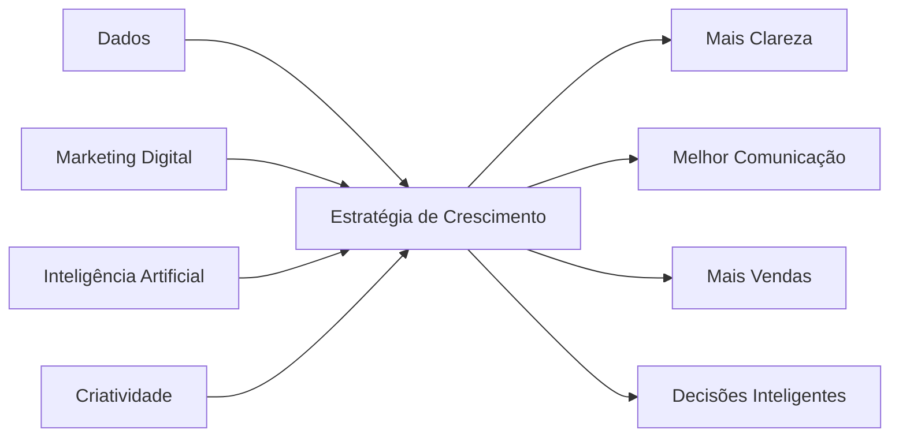
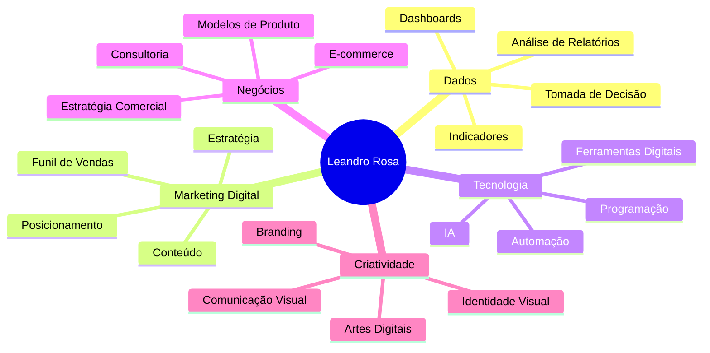
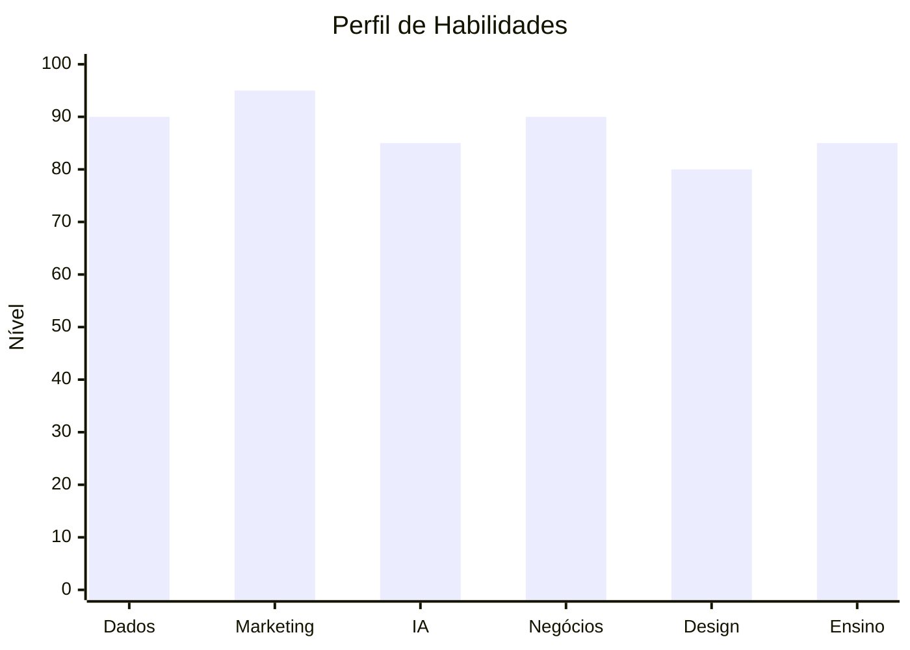
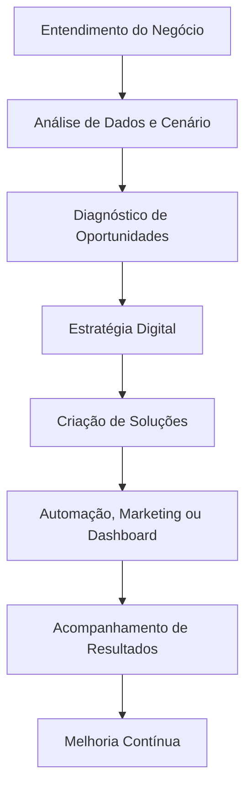
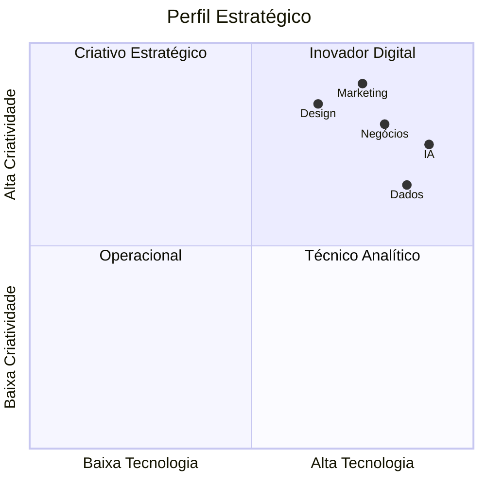
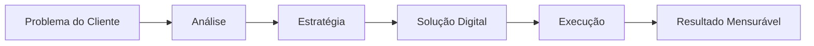
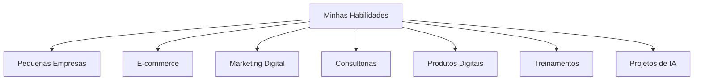

# 👋 Olá, eu sou Leandro Rosa

## Consultor em Dados, Marketing Digital e Soluções com IA

Sou um profissional com perfil híbrido que conecta **dados, tecnologia, marketing digital, criatividade e visão de negócios** para transformar informações em estratégias práticas, soluções digitais e oportunidades de crescimento.

Meu objetivo é ajudar pequenos negócios, empreendedores e empresas a tomarem decisões mais inteligentes, melhorarem sua presença digital e venderem com mais estratégia usando **análise de dados, automação, inteligência artificial e marketing digital**.

---

## 🚀 Minha Proposta de Valor

---

## 🧠 Principais Habilidades

| Área | Habilidades |
|---|---|
| 📊 Dados | Análise de relatórios, dashboards, KPIs, interpretação de indicadores |
| 📈 Marketing Digital | Estratégia de conteúdo, funil de vendas, tráfego, presença digital |
| 🤖 Inteligência Artificial | Chatbots, automações, prompts, agentes de IA, atendimento inteligente |
| 🎨 Criatividade Digital | Identidade visual, artes, branding, produtos visuais |
| 🛒 E-commerce | Mercado Livre, estrutura de produtos, páginas de venda, ofertas |
| 💼 Negócios | Estratégia comercial, posicionamento, modelo de produto, consultoria |
| 🧑‍🏫 Ensino | Didática, treinamentos, simplificação de temas complexos |

---

## 📌 Mapa Visual das Competências

---

## 📊 Nível de Afinidade por Área

---

## 🔥 O que eu faço

### 📊 Dados e Indicadores

Transformo dados em informações úteis para decisões de negócio.

- Criação de dashboards
- Análise de relatórios
- Indicadores de vendas
- Métricas de marketing
- Organização de dados
- Apoio à tomada de decisão

---

### 📈 Marketing Digital

Ajudo negócios a melhorarem sua comunicação, presença online e estratégia de vendas.

- Planejamento de conteúdo
- Estratégia para redes sociais
- Funil de vendas
- Posicionamento digital
- Análise de perfil comercial
- Diagnóstico de marketing

---

### 🤖 Inteligência Artificial Aplicada

Uso IA para criar soluções práticas que economizam tempo, melhoram o atendimento e apoiam vendas.

- Chatbots inteligentes
- Automação de atendimento
- Prompts estratégicos
- IA para marketing
- IA para vendas
- Treinadores virtuais

---

### 🎨 Design e Branding

Crio soluções visuais com foco em percepção de valor, clareza e posicionamento.

- Identidade visual
- Artes para redes sociais
- Criativos comerciais
- Apresentações
- Materiais digitais
- Comunicação visual estratégica

---

## 🛠️ Ferramentas e Tecnologias

---

## 📍 Jornada de Solução

---

## 💡 Serviços que posso oferecer

| Serviço | Resultado para o cliente |
|---|---|
| Dashboard de Vendas | Clareza sobre desempenho comercial |
| Diagnóstico de Marketing | Identificação de pontos de melhoria |
| Estratégia para Instagram | Conteúdo com mais direção e propósito |
| Chatbot de Atendimento | Respostas rápidas e captação de leads |
| Automação de WhatsApp | Mais agilidade no atendimento |
| Identidade Visual | Marca mais profissional |
| Estrutura de E-commerce | Produtos melhor apresentados |
| Treinamento de Equipe | Pessoas mais preparadas para usar dados e IA |
| Consultoria com IA | Processos mais inteligentes e produtivos |

---

## 🎯 Perfil Profissional

---

## 📚 Temas que estudo e aplico

- Análise de dados
- Marketing digital
- Inteligência artificial
- Programação
- Automação
- E-commerce
- Estratégia de vendas
- Branding
- Criação de produtos digitais
- Dashboards e indicadores
- Conteúdo para redes sociais
- IA aplicada a negócios

---

## 📈 Como gero valor

---

## 🧩 Diferenciais

- Visão integrada entre **dados, marketing e negócios**
- Facilidade com **tecnologia e ferramentas digitais**
- Criatividade aplicada à solução de problemas reais
- Capacidade de transformar ideias em produtos digitais
- Comunicação clara e didática
- Perfil estratégico para pequenas empresas
- Interesse constante por IA, programação e automação

---

## 🏆 Resumo Profissional

> Tenho facilidade para unir dados, tecnologia e criatividade para criar soluções digitais, melhorar a comunicação visual e estruturar estratégias de venda para negócios online.

Atuo com foco em transformar informações em decisões, ideias em produtos e estratégias em ações práticas para crescimento digital.

---

## 📌 Possíveis Projetos no GitHub

| Projeto | Descrição |
|---|---|
| Dashboard de Marketing | Painel para acompanhar métricas de campanhas e redes sociais |
| Análise de Vendas | Projeto com dados de vendas, gráficos e insights |
| Chatbot Comercial | Assistente de IA para atendimento inicial de clientes |
| Diagnóstico de Instagram | Ferramenta para avaliar presença digital |
| Funil de Vendas Digital | Modelo visual para estruturar jornada do cliente |
| Automação de Relatórios | Geração automática de relatórios com Python |
| E-commerce Analytics | Análise de produtos, vendas e performance online |

---

## 🌐 Onde posso aplicar minhas habilidades

---

## 📲 Conecte-se comigo

- 💼 LinkedIn: `https://www.linkedin.com/in/leandronogueirarosa/`
- 📸 Instagram LIB Digital: `https://www.instagram.com/libdigitalbrasil/`
- 📸 Instagram Pessoal: `https://www.instagram.com/leandrorosa.n/`
- 🌐 Site/Portfólio: `https://libdigital.lovable.app/`
- 📧 E-mail: `leandrorosa.nogueira@gmail.com`

---

## 🚀 Frase de Posicionamento

**Dados mostram o caminho.  
Marketing conecta com pessoas.  
Tecnologia acelera resultados.  
Estratégia transforma tudo isso em crescimento.**

---

# ⭐ Obrigado por visitar meu perfil

Se você chegou até aqui, seja bem-vindo ao meu espaço de projetos, aprendizados e soluções digitais.

Aqui compartilho minha evolução em tecnologia, dados, marketing digital e inteligência artificial aplicada a negócios.
